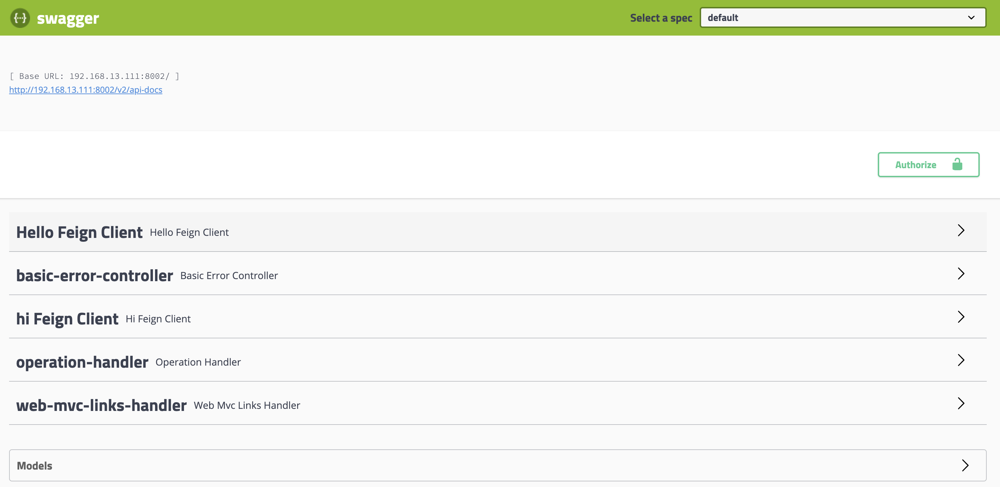
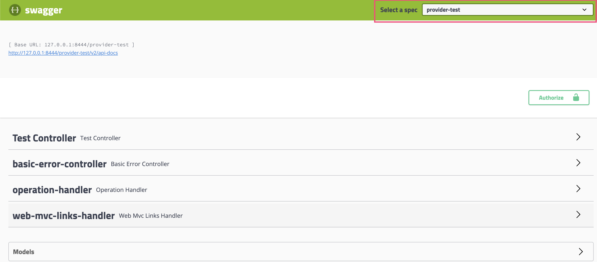

# swagger 配置

<!-- @import "[TOC]" {cmd="toc" depthFrom=2 depthTo=6 orderedList=false} -->
<!-- code_chunk_output -->

* [项目集成swagger](#项目集成swagger)
* [Eureka控制台快速查看Swagger文档](#eureka控制台快速查看swagger文档)
* [修改请求认证](#修改请求认证)
* [在网关中聚合多个服务](#在网关中聚合多个服务)

<!-- /code_chunk_output -->
## 项目集成swagger

1. 使用封装好的swagger

   ```xml
   <!--API 文档管理-->
   <dependency>
     <groupId>com.spring4all</groupId>
     <artifactId>swagger-spring-boot-starter</artifactId>
     <version>1.9.0.RELEASE</version>
   </dependency>
   ```

2. 在启动类配置@EnableSwagger2Doc

   ```java
   @EnableSwagger2Doc
   @SpringBootApplication
   @EnableFeignClients
   public class ProviderTestApplication {

       public static void main(String[] args) {
           SpringApplication.run(ProviderTestApplication.class, args);
       }

   }
   ```

3. controller使用

   ```java
   @Api(tags = "Test Controller")
   @RestController
   @RequestMapping(value = "/test",produces = MediaType.APPLICATION_JSON_UTF8_VALUE)
   public class TestController {

       @Resource
       private HelloFeignApi helloFeignApi;
       @Resource
       private HiFactoryFeignApi hiFactoryFeignApi;

       @ApiOperation(value = "say hello")
       @GetMapping(value = "/hello")
       public Wrapper<String> sayHello(){
           return helloFeignApi.sayHello("test");
       }
       @ApiOperation(value = "say hi")
       @GetMapping(value = "/hi")
       public Wrapper<String> sayHi(){
           return hiFactoryFeignApi.sayHi("test");
       }
   }
   ```

4. FeignClient使用


   ```java
   @Api(tags = "Hello Feign Client")
   @RestController
   public class HelloFeignClient extends BaseController implements HelloFeignApi {
       @ApiOperation(value = "say hello to sb")
       @Override
       public Wrapper<String> sayHello(@PathVariable String somebody) {
           return WrapMapper.ok("hello"+somebody);
       }
   }
   ```


5. 接口访问


   ```	html
   http://192.168.13.111:8002/swagger-ui.html
   ```


   

## Eureka控制台快速查看Swagger文档

1. 修改配置文件，重定向

   ```yml
   eureka:
     instance:
       status-page-url: http://${spring.cloud.client.ipaddress}:${server.port}/swagger-ui.html
   ```

2. 点击如下，即可跳转

   

## 修改请求认证

```properties
swagger.authorization.key-name=Authorization
```

## 在网关中聚合多个服务

1. 在zuul中引入依赖

   ```xml
   <!--聚合swagger服务-->
   <dependency>
     <groupId>io.springfox</groupId>
     <artifactId>springfox-swagger-ui</artifactId>
     <version>2.9.2</version>
   </dependency>
   <dependency>
     <groupId>io.springfox</groupId>
     <artifactId>springfox-swagger2</artifactId>
     <version>2.9.2</version>
   </dependency>
   ```


2. 配置Provider

   ```java
   /**
    *
    * @author uyaki
    * @date 2019-08-22 11:36
    */
   @EnableSwagger2
   @Component
   @Primary
   public class DocumentationConfig implements SwaggerResourcesProvider {
       @Autowired
       private DiscoveryClient discoveryClient;
       @Value("${spring.application.name}")
       private String applicationName;
       @Override
       public List<SwaggerResource> get() {
           List<SwaggerResource> resources = new ArrayList<>();
           discoveryClient.getServices().stream().filter(
                   s -> !s.equals(applicationName)
           ).forEach(name->{
               resources.add(swaggerResource(name, "/" + name + "/v2/api-docs", "2.0"));
           });
           return resources;
       }

       private SwaggerResource swaggerResource(String name, String location, String version) {
           SwaggerResource swaggerResource = new SwaggerResource();
           swaggerResource.setName(name);
           swaggerResource.setLocation(location);
           swaggerResource.setSwaggerVersion(version);
           return swaggerResource;
       }
   }
   ```

3. 访问[http://127.0.0.1:8444/swagger-ui.html](http://127.0.0.1:8444/swagger-ui.html)，可以在右上角切换

   
