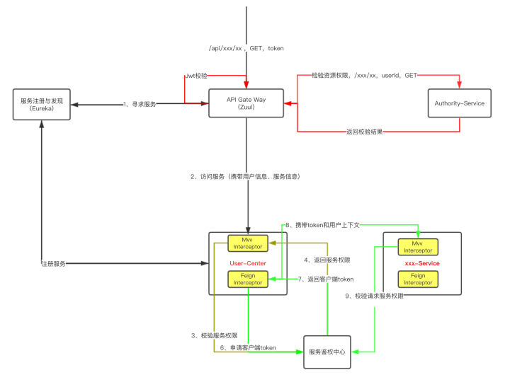
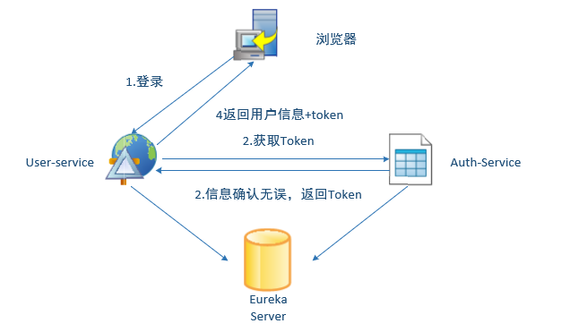

# OAuth2和JWT的区别

<!-- @import "[TOC]" {cmd="toc" depthFrom=2 depthTo=6 orderedList=false} -->
<!-- code_chunk_output -->

* [区别](#区别)
	* [OAuth2认证框架](#oauth2认证框架)
* [JWT认证协议](#jwt认证协议)
* [JWT](#jwt)
	* [生成Token格式](#生成token格式)
* [工程架构图](#工程架构图)

<!-- /code_chunk_output -->

## 区别

### OAuth2认证框架

- OAuth2中包含四个角色
  - 资源拥有者(Resource Owner)
  - 资源服务器(Resource Server)
  - 授权服务器(Authorization Server)
  - 客户端(Client)

- OAuth2包含4种授权模式

  - 授权码（认证码）模式 （Authorization code)
  - 简化（隐形）模式 (Impilict
  - 用户名密码模式 (Resource Owner Password Credential)
  - 客户端模式 (Client Credential)

- 运行图如下，引用自[RFC 6749](https://tools.ietf.org/html/rfc6749)

  ```
       +--------+                               +---------------+
       |        |--(A)- Authorization Request ->|   Resource    |
       |        |                               |     Owner     |
       |        |<-(B)-- Authorization Grant ---|               |
       |        |                               +---------------+
       |        |
       |        |                               +---------------+
       |        |--(C)-- Authorization Grant -->| Authorization |
       | Client |                               |     Server    |
       |        |<-(D)----- Access Token -------|               |
       |        |                               +---------------+
       |        |
       |        |                               +---------------+
       |        |--(E)----- Access Token ------>|    Resource   |
       |        |                               |     Server    |
       |        |<-(F)--- Protected Resource ---|               |
       +--------+                               +---------------+
  ```

>  在Spring Cloud OAuth2中，所有访问微服务资源的请求都在Http Header中携带Token，被访问的服务接下来再去请求授权服务器验证Token的有效性，目前这种方式，我们需要两次或者更多次的请求，所有的Token**有效性校验都落在的授权服务器**上，对于我们系统的水平扩展成为一个非常大的瓶颈。

## JWT认证协议

> 授权服务器将**用户信息**和**授权范围** **序列化后放入一个JSON字符串**，然后使用**Base64进行编码**，最终在授权服务器用**私钥**对这个字符串进行**签名**，得到一个JSON Web Token。

> 假设其他所有的资源服务器都将持有一个RSA公钥，当资源服务器接收到这个在Http Header中存有Token的请求，资源服务器就可以拿到这个Token，并验证它是否使用正确的私钥签名（是否经过授权服务器签名，也就是验签）。验签通过，反序列化后就拿到Toekn中包含的有效验证信息。

```text
+-----------+                                     +-------------+
|           |       1-Request Authorization       |             |
|           |------------------------------------>|             |
|           |     grant_type&username&password    |             |--+
|           |                                     |Authorization|  | 2-Gen
|           |                                     |Service      |  |   JWT
|           |       3-Response Authorization      |             |<-+
|           |<------------------------------------| Private Key |
|           |    access_token / refresh_token     |             |
|           |    token_type / expire_in           |             |
|  Client   |                                     +-------------+
|           |
|           |                                     +-------------+
|           |       4-Request Resource            |             |
|           |-----------------------------------> |             |
|           | Authorization: bearer Access Token  |             |--+
|           |                                     | Resource    |  | 5-Verify
|           |                                     | Service     |  |  Token
|           |       6-Response Resource           |             |<-+
|           |<----------------------------------- | Public Key  |
+-----------+                                     +-------------+
```



## JWT

### 生成Token格式

**头部header**+**消息体payload**+**签名signature**

```bash
token=encodeBase64(header)+'.'+encodeBase64(payload)+'.'+encodeBase64(signature)
```

- header

  - 令牌类型
  - 使用的签名算法

  ```json
  {"alg":"HS256","typ":"JWT"}
  ```

- 消息体

  - 自己需要的信息，如用户名等

  ```json
  {"id":"123","name":"uyaki","admin":true}
  ```

- 签名
  - 用来判断传递路上是否被篡改

## 工程架构图


