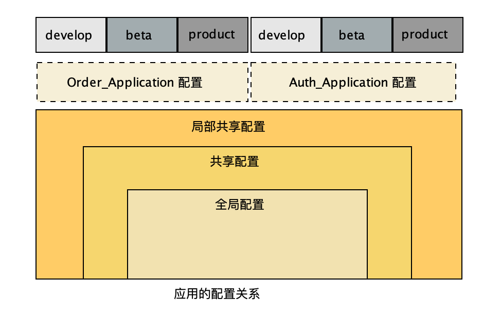
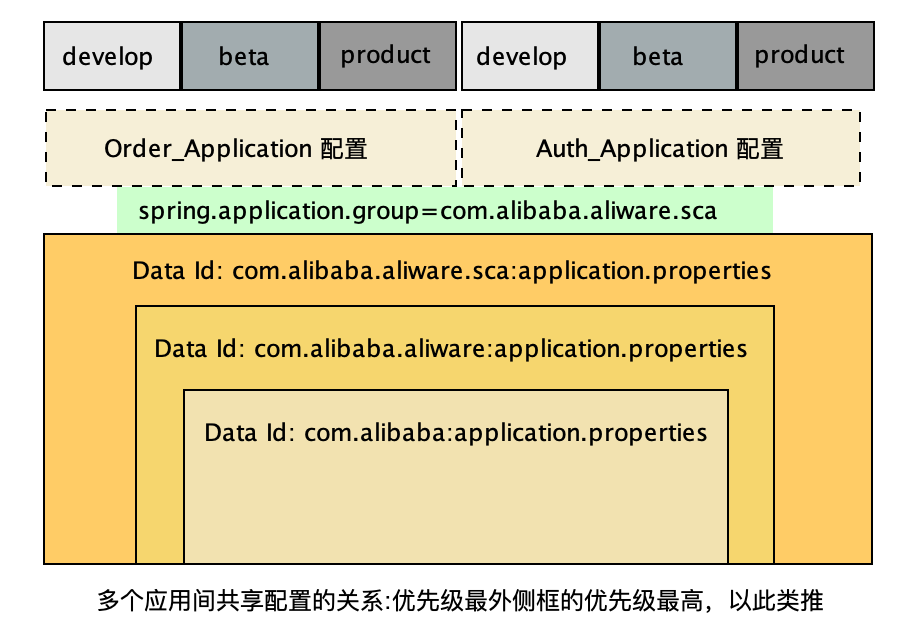
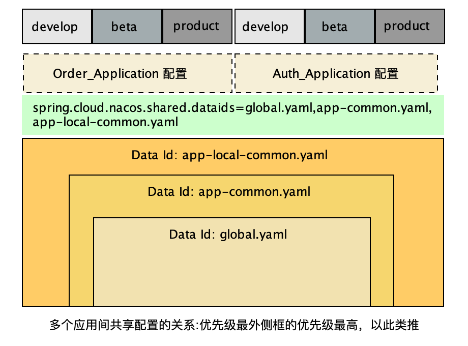

# SCA Nacos Config 共享配置方案设计

## 原文链接

[SCA Nacos Config 共享配置方案设计](https://github.com/alibaba/spring-cloud-alibaba/issues/141)

## 实际情况

在实际的业务场景中应用和共享配置间的关系可能如下图所示：



- 从单个应用的角度来看： 应用可能会有多套(develop/beta/product)发布环境，多套发布环境之间有不同的基础配置，例如数据库。
- 从多个应用的角度来看：多个应用间可能会有一些共享通用的配置，比如多个应用之间共用一套zookeeper集群。

目前 SCA Nacos Config 可以灵活的支持单个应用间在多套环境可灵活的切换，但是在多个应用间共享一些通用的配置支持的还不是很完美。
本方案设计的目标就是来解决这个问题。目前有三种设计方案，分别是：

- 新增一个应用分组的配置，分组命名的格式是 通过域名的命名方式，来自动的生成共享配置的 Data Id。
- 自定义命名的方式来命名 Data Id 。
- 通过类似面向对象的方式自定义配置（相对于第二种的升级版）。

下面分别来分析三种方案的具体实现和优缺点。

## 基于域名的配置方式给应用分组

通过一个配置参数(例如：${spring.application.group}) 来指明当前应用所属的分组(或者说所属的域)。
例如我有两个应用分别为Order_Application和Auth_Application，给这两个应用配置的分组名(域)是：

```bash
spring.application.group=com.alibaba.aliware.edas
```

那对于Spring Cloud Alibaba Nacos Config 来说，多个应用可以属于 com.alibaba 这个应用分组(域)，也可以属于
com.alibaba.aliware 这个应用分组(域)，当然也可以属于 com.alibaba.aliware.edas 这个应用分组(域)。



以这种方式来实现多个应用间的配置共享，可以看出他具有天然的局限性。

- 受到 ${spring.application.group }配置的影响，Data Id 的表现力是非常有限的(当然85%的场景应该够用了)。
  - 一方面是Data Id 的命名个数受到了限制。
  - 另一方面如果两个应用的 file-extension 不一致(一个是properties,一个是yaml)，那这个时候共享配置的Data Id 必须同时要含有 properties 和 yaml 为扩展名的配置。
  - Data Id 的命名也受到了 ${spring.application.group } 配置的束缚。
- 学习成本偏高(当然还是可以学会的)。学习成本偏高体现在：
  - 要知道Data Id 的命名规则，才能在项目实施过程中对 Data Id 的命名运用自如。
  - 此外对于域名命名的层次个数也不太好把握。少了的话，担心dataid的个数不够用，多了的话看上去有显得的比较冗余。
  - 还需要学习并理解这里配置的优先级，不然在程序中有可能就会拿到意想不到的配置。
- 易出错(当然是可以克服的)。对于多级应用分组的配置共享，这个时候Data Id 的命名要格外注意了。注意他们的层次关系，Data Id 书写时不要张冠李戴。
- 实现起来稍微复杂

当然他的好处也非常明显，当你理解了他背后的设计理念时，这个共享配置的层次也非常明显。因为层次的关系天然依托于域名的层次关系。

## 自定义的方式来命名 Data Id

这种方式实现简单易懂，即 SCA Nacos Config 会新增加一个配置，用来配置可实现共享配置所有的 Data Id。如下所示：

```bash
spring.cloud.nacos.shared.dataids=global.yaml,app-common.yaml,app-local-common.yaml
```

**NOTE:** 为了尽可能的和Nacos使用方式(即Data Id 是一个带有额外文件扩展名的)保持一致，这里配置的Data Id 是一定需要带上文件扩展名的。

这个时候两个应用(或多个应用)之间共享配置的 Data Id 关系如下图所示：



Spring Boot 提倡约定大于配置。当使用这种方式来实现应用间的共享配置时，我们也继承了Spring Boot的这个优良传统，多个共享配置间的一个优先级的关系我们约定：按照**配置出现的先后顺序**，即后面的优先级要高于前面的。
这种方式的优点在于：

- dataid的命名方式完全交给业务方本身，不受 SCA Nacos Config Starter 实现的束缚。
- dataid的命名方式既可以参考第一种方式来命名，又可以充分的发挥主观能动性，结合自己实际的业务给dataid命名。
- 减少了多个应用间如果file-extension不一致，为每个 file-extension 多加这么一个配置的麻烦。
- 当使用这种方式时，不会为这些共享配置强制绑定一个 file-extenson，即可以直接在我们暴露出来的一个变量中 dataid以file-extension 结尾。如果没有显示的说明，这个时候就会以file-extenson为准。

当然这种方案的缺点在于扩展性不强。即如果对于某个共享配置需要做额外的配置，例如额外配置Group/是否需要刷新/是否需要从本地缓存加载等等。因此为了应对这种类型的场景，小组内讨论出了第三种方案。

## 通过类似面向对象方式的自定义配置

**说明：** *Spring 可以支持在加了 ConfigurationProperties 注解配置类的内部某个对象实例来注入应用中的一些配置。*

这种使用方式查了一下官方和网络上没有一个大的标题总结，结合这种方式很像给某个实例中的字段赋值，所以这里先暂时取名：
类似面向对象方式的自定义配置(有更好能够形象的标明其含义的命名可以在下面留下评论-_-)。

这种方案沿用了第二种设计方案的优点，同时又弥补了第二种方案的不足。我们通过内部定义一个对象，来支持一些灵活的扩展配置。
我们给这个对象可以预留一些可扩展的配置字段。例如：

```java
public class Config{
    private String dataId;
    private String group = "DEFAULT_GROUP";
    private Boolean refresh = false;
    //.....后期可能还有其他的一些配置

    //省略 set/get 方法
}
```

最终在实现时是可以支持以list的方式来配置其值。如下是两个扩展配置的实例：

```
spring.cloud.nacos.config.ext-config[0].data-id=global-shared.properties # group 和referesh 使用默认值
spring.cloud.nacos.config.ext-config[1].data-id=app-common.properties
spring.cloud.nacos.config.ext-config[1].group=DEVELOP_GROUP #配置自定义所在的组
spring.cloud.nacos.config.ext-config[1].refresh=true #需要刷新
```

**NOTE:** 为了尽可能的和Nacos使用方式(即data id是一个带有额外文件扩展名的)保持一致，这里配置的dataid是一定需要带上文件扩展名的。